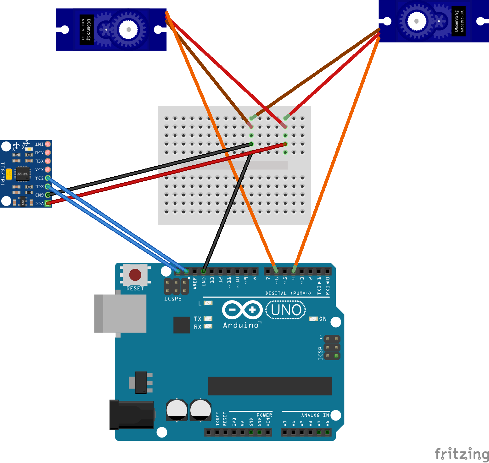

# Selbstlernende Roboter programmieren und testen im Rahmen der ZHAW Science Week 2025.

"In diesem Kurs baust du einen kleinen Roboter, der sich selbst fortbewegen kann. Im ersten Teil programmierst du Bewegungen und versuchst, den Bewegungsablauf zu optimieren. Im zweiten Teil bauen wir ein Stück in die Software ein, das selbstlernend ist. Danach werden wir testen, ob die selbstlernende Variante besser funktioniert als die, die wir programmiert haben." Aus dem Flyer der ZHAW

# Materialliste
Wir arbeiten mit überall erhältlichen Mikroelektronik-Elementen. Hier unsere Materialliste, in diesem Jahr bestellt bei reichelt.com - andere Bezugsquellen sind bastelgarage.ch, 3djake.ch, digitec.ch, mouser.ch, ... es gibt viele Anbieter, meistens erhält man die gleiche Hardware.

## Hardware

### Arduino Uno
https://www.reichelt.com/ch/de/shop/produkt/arduino_uno_rev_3_smd-variante_atmega328_usb-119045  
Unsere Rechnungseinheit

### Breadboard transparent
https://www.reichelt.com/ch/de/shop/produkt/experimentier-steckboard_170_kontakte_transparent-282595  
Die Basis für unsere Verkabelung

### Breadboard farbig
https://www.reichelt.com/ch/de/shop/produkt/experimentier-steckboard_55_kontakte_7er-set-282598  
Die Basis für die Fernsteuerung

### USB-Kabel
https://www.reichelt.com/ch/de/shop/produkt/usb_2_0_kabel_a_stecker_auf_b_stecker_schwarz_0_5_m-202193  
Zum Upload der Software auf den Arduino

### Steckbrückenkabel
https://www.reichelt.com/ch/de/shop/produkt/entwicklerboards_-_steckbrueckenkabel_40_pole_m_m_40_cm-340347  
Die farbigen Verbindungskäbelchen

### XYZ-Sensor
https://www.reichelt.com/ch/de/shop/produkt/entwicklerboards_-_beschleunigung_gyroskop_mit_header_mpu-60-266105  
Er zeigt uns an, ob sich unser Roboter bewegt

### Servo-Motoren
https://www.reichelt.com/ch/de/shop/produkt/servo_high_end_micro_analog-238316  
Sie bewegen die Klammern und ermöglichen es dem Roboter, sich zu bewegen

### Potentiometer
https://...  
Sie bilden die Eingabemglichkeit für die Fernbedienung

### Li-Ionen-Akku
https://www.reichelt.com/ch/de/shop/produkt/li-ion-akku_9v_block_7_4_v_500_mah_usb-c_2er-pack-372316  
Die akkus für den Betrieb im freien Feld, fernab von einem Computer

### 3D-gedruckte Klammern
https://www.thingiverse.com/thing:2271734  
Diese Klammern machen aus den rund drehenden Servo-Motoren richtige Arme oder Beine

### Diverses Kleinmaterial (Schräubchen, Muttern, Klebeband, Mausmatte, Werkzeug, Kartonschachtel)
Was so rumliegt

## Software

### Arduino IDE
https://www.arduino.cc/en/software/  
Die Software ist gratis. Sie ermöglicht es uns, unsere Befehle an den Roboter zu übermitteln.

## Schemata

### Schema für Fernsteuerungsbetrieb

### Schema für Koninuierliches, sinoidales oder selbstlernendes Laufen (wie oben aber ohne Fernbedienungsteile)

## Code Schnipsel

### Fernsteuerung
[Code für die Fernsteuerung](./code_fernsteuerung.ino)

### Kontinuierliches Laufen (3 Positionen)
[Code für kontinuierliches Laufen](./code_kontinuierlich.ino)

### Kontinuierliches Laufen (Sinus)
[Code für die Fernsteuerung](./code_sinus.ino)

### Selbstlernendes Laufen
[Code für die Fernsteuerung](./code_selbstlernend.ino)